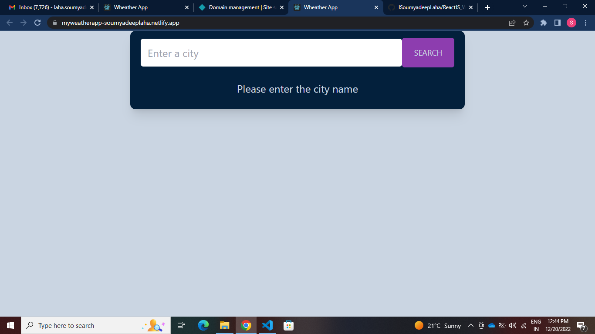
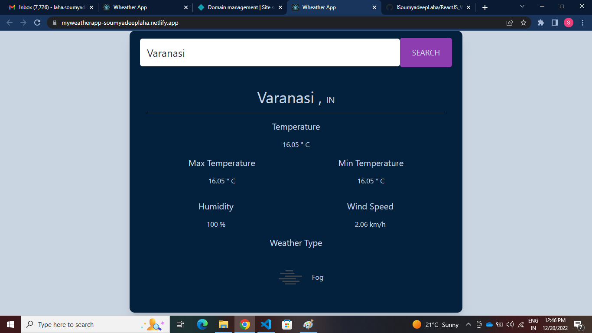

# My Weather App 👩🏻‍💻 🌥️

description:- Created weather app using React js and Open Weather API.

# Technology Stack:
    🛠️ React JS
    🛠️ Tailwind CSS
    🛠️ Axios

# Backend API:
    🛠️ Open weather API

# Key Learnings:
    ✅Learn about how to create different components in react.
    ✅Learn how to use the react hooks: useState().
    ✅Learn about the concept of react controlled component.
    ✅Learn about react conditional rendering.
    ✅Learn how to consume data from API and render those data in UI.

# Screen Shorts: 📸

# Live link: ✈️

[Netlify Link...](https://myweatherapp-soumyadeeplaha.netlify.app/)